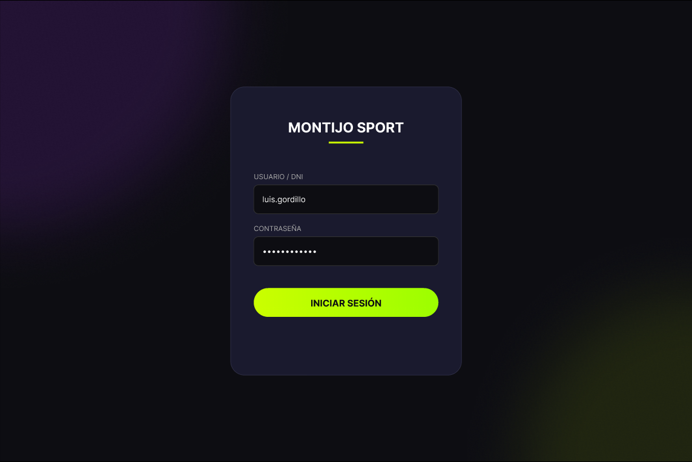
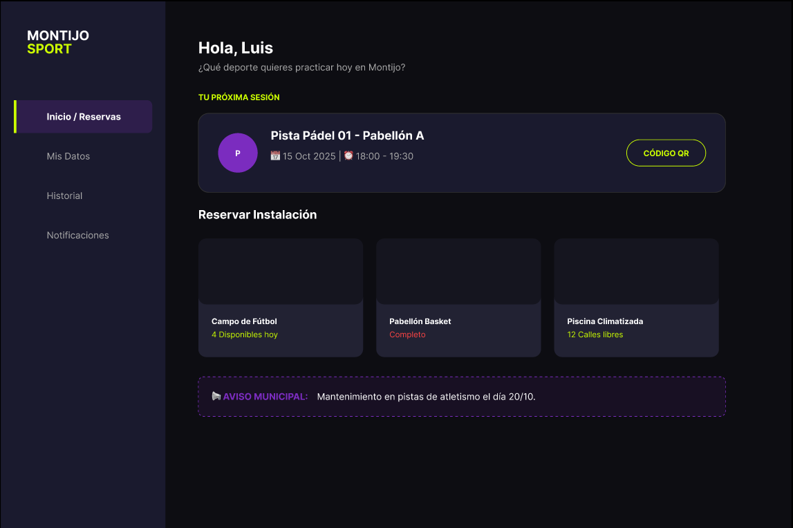

# 🏟️ Montijo Sport - Gestor de Instalaciones Deportivas

<div align="center">
  <h1 style="font-size: 3rem; color: #CCFF00;">MONTIJO SPORT</h1>
  
  
  
  
  
  
  <br />

  <p align="center">
    <strong>Modernizando el deporte municipal con una experiencia digital premium.</strong>
    <br />
    Aplicación Web Progresiva (PWA) para la gestión integral de reservas, inventario e incidencias.
  </p>
</div>

---

## 📋 Sobre el Proyecto

**Montijo Sport** nace como respuesta a la necesidad de digitalizar el sistema deportivo municipal. El objetivo es eliminar la burocracia, optimizar la ocupación de pistas y mejorar la comunicación entre el ayuntamiento y los ciudadanos.

El proyecto destaca por su **Interfaz "Dark Mode"** moderna con acentos en *Acid Lime* y *Cyber Purple*, ofreciendo una experiencia de usuario ágil y visualmente impactante.

## ✨ Características Principales

* 🔐 **Autenticación Segura:** Login robusto conectado con Supabase Auth.
* 📅 **Gestión de Reservas:** Sistema visual para reservar pistas (Pádel, Fútbol, Tenis) en tiempo real.
* 📦 **Inventario Deportivo:** Control de stock de material (balones, redes, petos) para los conserjes.
* 📢 **Notificaciones y Avisos:** Panel de incidencias y comunicados municipales.
* 📊 **Dashboard Interactivo:** Panel de control personalizado para cada usuario.

## 🎨 Galería del Proyecto

Aquí puedes ver el diseño y la implementación actual de la interfaz:

| **Login Premium** | **Dashboard Principal** |
|:---:|:---:|
|  |  |
| *Acceso seguro con animaciones neón* | *Vista general de reservas y avisos* |

## 🛠️ Tecnologías Utilizadas

* **Frontend:** React.js + Vite
* **Estilos:** Tailwind CSS (Custom Design System)
* **Backend & Base de Datos:** Supabase (PostgreSQL)
* **Iconografía:** Lucide React
* **Control de Versiones:** Git & GitHub

## 🚀 Instalación y Despliegue

Sigue estos pasos para ejecutar el proyecto en tu entorno local:

1.  **Clonar el repositorio:**
    ```bash
    git clone [https://github.com/TU_USUARIO/montijo-sport.git](https://github.com/TU_USUARIO/montijo-sport.git)
    cd montijo-sport
    ```

2.  **Instalar dependencias:**
    ```bash
    npm install
    ```

3.  **Configurar Variables de Entorno:**
    Crea un archivo `.env` en la raíz del proyecto y añade tus credenciales de Supabase:
    ```env
    VITE_SUPABASE_URL=tu_url_aqui
    VITE_SUPABASE_ANON_KEY=tu_clave_anon_aqui
    ```

4.  **Ejecutar en desarrollo:**
    ```bash
    npm run dev
    ```

## 📅 Roadmap (Planificación)

- [x] **Semana 1:** Configuración de entorno, Tailwind, Diseño UI y Login funcional.
- [ ] **Semana 2:** Base de Datos (Tablas Reales) y Dashboard Dinámico.
- [ ] **Semana 3:** Sistema de Reservas y lógica de disponibilidad.
- [ ] **Semana 4:** Gestión de Inventario y Panel de Admin.
- [ ] **Semana 5:** Perfil de usuario, incidencias y pulido final.

---

<div align="center">
  Creado por <strong>Luis Gordillo</strong> | TFG - IES Albarregas
</div>